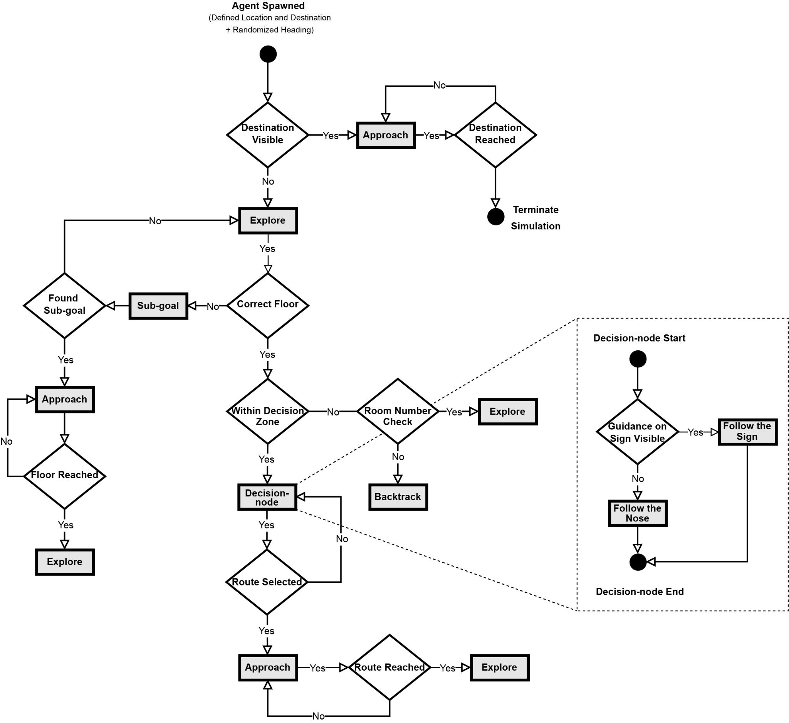

# Overview

## Setting up a scene:
When in doubt, check the "Terrace" scene for reference on how to do things.

1. When importing the environment, make sure all meshes are given Colliders and set to the tag that applies ("Floor" to the floor, "Wall" to the walls etc.)
2. Drop in a player (or smart agent) prefab
3. Give that prefab its Isovist (see below)
4. Hit play on the scene

## Player and Smart Agent
A smart agent is an agent that autonomously navigates an environment. A Player is a smart agent (subclass) that also has a mode that allows it to be manually controlled. Press "k" to toggle this mode.

Scriptable objects are used for the isovists for each agent. If you want to create a new agent it must have a UNIQUE isovist object. You can create new scriptable objects at runtime like `ScriptableObject.CreateInstance<Isovist>()` and calling `agent.GetComponent<FieldOfView>.SetIsovist(isovist)` to make sure the agent gets that isovist. If you are placing a player or agent in the scene, you must give it an isovist by first creating one in the resource window (Assets folder) in Unity, `right click > Create > Isovist`. Then, drag the isovist into the `FieldOfView` component in the prefab.

## Generating Signage
Signage is generated via the `SignManager` script. Make an empty in the scene, make sure it is at position 0, 0, 0 and rotation 0, 0, 0, and then attach a "SignManager" component. Give the sign manager a prefab (model of sign, one is provided), a layout in the form of a json, and a direction prefab (provided as a prefab titled "Directions"). Then click "Generate Signs" in the inspector. This will generate all the signs from the json.

## Generating Visibility Graph
Similar to signage, create an empty and attach the "WorldGridContainer" component. Then you must make a scriptable object that contains the settings for the graph. In the resource window (Assets folder) in Unity, `right click > Create > World Grid`. Name it whatever, mess with the settings (see "Terrace" scriptable object in the ScriptableObjects folder for reference), and then add it to the WorldGridContainer you created earlier. Then click the "Generate Heatmap" button in the inspector to generate the graph (this may take a while).

## Path Viewing
Paths can be generated from agents (see `CrowdAgentSpawner` as example). If the paths are exported as .csv, make an empty in the scene and give it an `AgentLineDrawer` component. Select all paths in the resource window (shift + click) and drag all of them too the `Files` field in the inspector. Adjust the settings and click "Visualize Paths" to see the paths. To clear the list, set the size of `Files` to 0. 

## Running a task

1. Grab player manually to the start position
2. Enter name of destination in dest field in `SmartAgentController` component in the inspector
3. Attach the `Door` Gameobject corresponding to the destination
4. Play and press **k** to start the simulation (Follow the agent's state from the `StateMachine` component of the `Player`)

## Room numbers 
The room numbers form should look like the following: **FXL_D_N**, where 
* F (optional) = Floor letter
* X (required) = Room number.
* L (optional) = Room letter.(E.g: T411A, T411B, T411C, ...)
* D (optional) = Door number if a room has multiple doors. (E.g: T114_1, T114_2, ...)
* N (optional) = Name of the room. (E.g: T116A_cafe)

## Saving trajectory
Turn on `PathWriter` script under `Player`. This will save the **X,Y,Z** coordinates and **Uncertainty** value in a **csv** file. Enter the path to save this file in the `csv_path` variable.

## Generating graph matrix
1. Make an empty in the scene
2. Attach a `GraphGeneratorContainer` script to it
3. Attach a `GraphGenerator` scriptable object to the `GraphGeneratorContainer`. Make sure to assign the right path of the trajectory to the `trajectoryData` variable in `GraphGenerator`. This expects a cvs file with the same format as written by `PathWriter`.
4. Click **Generate Graph**. Matrix will be saved under *Assets/Data/Agents_Trajectory/graph.csv*

## Visualizing navigation graph
1. Run application
2. Check `DrawLines` from inspector under the `NavigationalGraph` script in `decisionpoint` GameObject
3. Switch to Scene tab view to visualize the graph. Make sure Gizmos visibility is activated

## Visualizing trajectory heatmap
1. Make an empty in the scene. Make sure it has position and rotation `(0, 0, 0)`
2. Attach `WorldGridContainer` script to it
3. Attach `PathVisualizer` scriptable object to the `World Grid` variable in the inspector. Make sure to assign the right path of the trajectory to the `pathData` variable in `PathVisualizer`. This expects a *cvs* file with the same format as written by `PathWriter`.
**n.b** To visualize participants trajectory, check the `participants` variable under `PathVisualizer` and set the correct file path to `pathData`.
4. Click **Generate Heatmap**. This will create children objects and assign them the right colors 

## Adding new floors
### 1. Floor
Add new floor model to the scene. Set all wall objects to `Layer` to `Wall` and add `Mesh Collider` component.

### 2. Stairs
Take a look at the children of the GameObject `Stairs` in the main tree under `Terrace_Main` scene:
* Stairs elements (stairs and platform) connect the two floors
* Each element (stairs and platform) has to be set to Walkable under Navigation > Object > Navigation Static
* Each stairs have their own signs named after and placed in the corresponding floor (E.g: -1, 0, 1, ...)
* Each stairs sign has `Layer` set to `Stairs`
* Access to stairs are blocked by doors called after the corresponding floor (E.g: door_-1, door_0, ...)
* Each door has `Layer` set to `Wall`. This prevents agent to change floors while exploring with no intention of changing floors

### 3. Signs
1. Add `SignManager` GameObject to the floor model and attach `SignManager` script to it
2. Create a scriptable object under ScriptableObjects/SignLayout, attach `SignLayout` script and the corresponding json file 
2. Attach `Sign` prefab, `SignLayout` scriptable object and `Directions` prefab to the `SignManager` script

### 4. Doors
Add doors to the different rooms with names as mentioned in the Room Numbers section in the Readme file. Set `Tag` to `Door` and attach script `Door`.

### 5. Decision Nodes
1. Add `decisionpoint`GameObject to the floor model and attach `NavigationalGraph` script to it
2. Manually add decision nodes and their possible directions as children. Take a look at the decision nodes implemented in the `Terrace_Main` scene in floor T, G and 1. 
3. Attach `DecisionPoint` script to each decision node. Manually set `id`

Decision nodes should not overlap. Direction subnodes should be outside of the corresponding decision node.

## Simulation Code
The simulation is mainly managed by the `StateMachine.cs` and `SmartAgentController.cs` scripts.

## Agent Spawning
Script `AgentSpawner.cs` has a list of agents to spawn agents sequentially: `partsList`. Each element in the list represents an agent and its parameters, saved as a struct called `PartInfo`.
1. To activate agent spawning, create a gameobject in the scene and add the `AgentSpawner.cs`. Deactivate any SmartAgent gameobject in the scene if activated
2. Enter the list of agents parameters in the `fillPartsList()` method. Common parameters like the uncertainty coefficients are set in the prefab `Spawned Agent` found in the prefabs folder
3. Assign the prefab `SpawnedAgent` to the variable `Player` in the script
4. Enter the spawning position and the destination name and assign the destination door gameobject.
5. Run the program

## Commands

### For MkDocs
* `mkdocs new [dir-name]` - Create a new project.
* `mkdocs serve` - Start the live-reloading docs server.
* `mkdocs build` - Build the documentation site.
* `mkdocs -h` - Print help message and exit.

### For Agent Project

* Ctrl + K, Ctrl + C (comment) , Ctrl + U (uncomment)
* Ctrl + K, Ctrl + 0 - collapse all functions
* Ctrl + K, Ctrl + J - unfold all functions

## Agent Function

